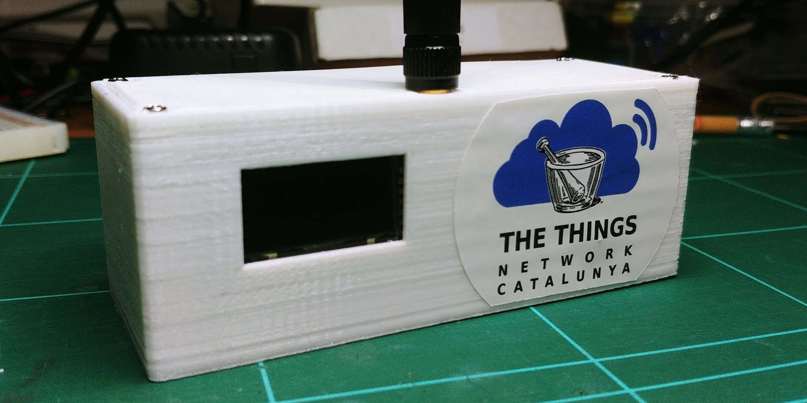
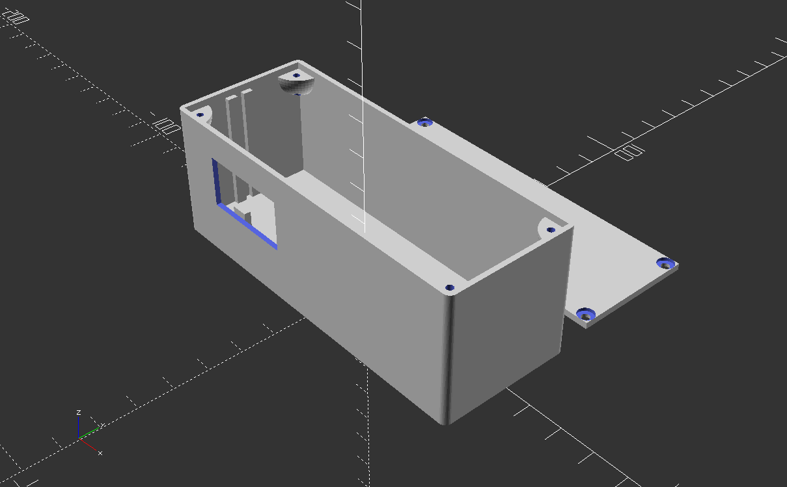

# TTN Tracker

This is a LoRaWAN node based on the TTGO T-Beam development platform.
It uses a RFM95 by HopeRF and the MCCI LoRaWAN LMIC stack.
The sample code is configured to connect to The Things Network using EU frequency, but you can easily change that.

This repository contains:

* 3D model of the enclosure, both OpenSCAD and STL files.
* Sample code that sends GPS data compatible with [TTNMapper](http://ttnmapper.org).
* Javascript decoder code to decode payload

## License

Copyright (C) 2018 by Xose Pérez (@xoseperez)

This program is free software: you can redistribute it and/or modify
it under the terms of the GNU General Public License as published by
the Free Software Foundation, either version 3 of the License, or
(at your option) any later version.

This program is distributed in the hope that it will be useful,
but WITHOUT ANY WARRANTY; without even the implied warranty of
MERCHANTABILITY or FITNESS FOR A PARTICULAR PURPOSE.  See the
GNU General Public License for more details.

You should have received a copy of the GNU General Public License
along with this program.  If not, see <http://www.gnu.org/licenses/>.
